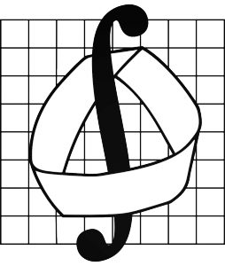

## Немного о себе

Я -- студент пятого курса Механико-математического факультета МГУ имени М.В. Ломоносова.

Это страница посвящена курсу, который я веду по пятницам в 203 кабинете СОШ 179.

Материалы курса когда-нибудь появятся на [соответсвующей странице](theory).
Задачи для решения дома можно найти [здесь](hprs)

## Научные интересы

Колмогоровская сложность и разные её вариации. 

## Ссылки и библиография

1. Hennessy, Patterson. Computer Architecture. A Quantitative Approach (6th edition)
2. Н.К. Верещагин, В.А. Успенский, А. Шень.
   [Колмогоровская сложность и алгоритмическая случайность](http://www.mccme.ru/free-books/shen/kolmbook.pdf)
